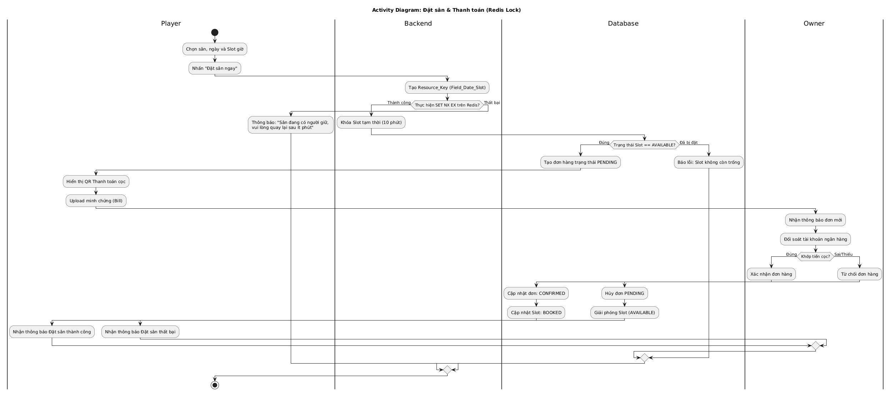
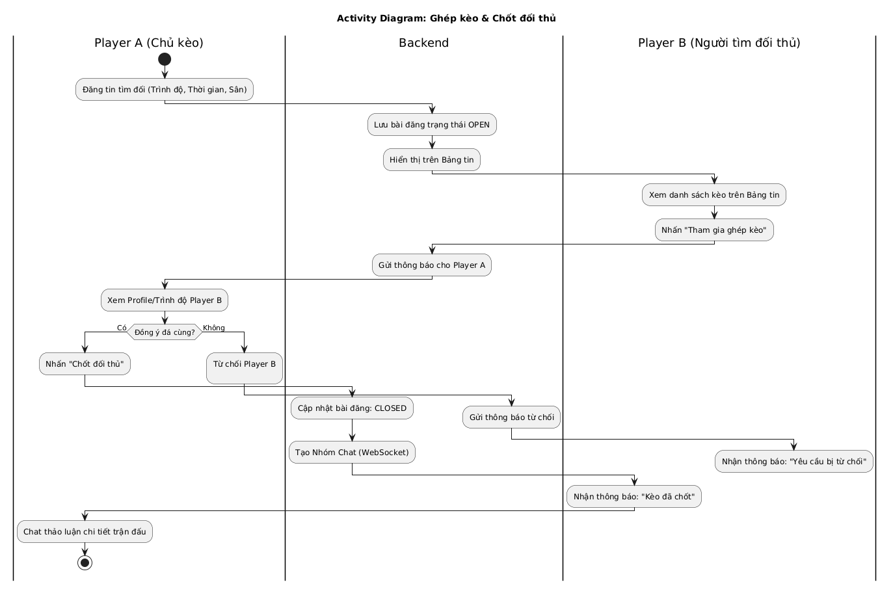
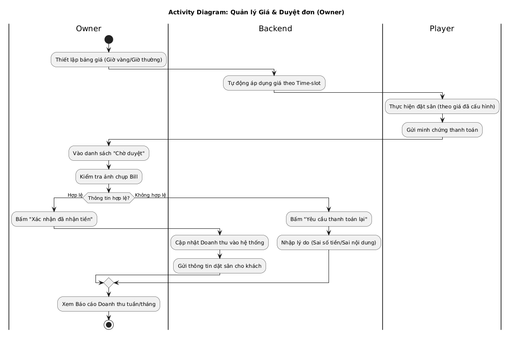

# 📋 ĐẶC TẢ HỆ THỐNG ĐẶT SÂN & GHÉP TRẬN

Dự án: **Hệ thống Quản lý Sân bóng & Kết nối Cộng đồng **

---

## 👥 1. DANH SÁCH TÁC NHÂN (ACTORS)

| Actor | Vai trò | Mô tả |
| :--- | :--- | :--- |
| **Guest** | Khách | Xem danh sách sân, tìm kiếm sân trống trước khi đăng ký. |
| **Player** | Người chơi | Tìm sân, đặt chỗ, quản lý đội bóng và tìm đối thủ (Matchmaking). |
| **Owner** | Chủ sân | Quản lý cơ sở vật chất, lịch biểu, giá cả và duyệt đơn đặt. |
| **Admin** | Quản trị | Kiểm soát nội dung, phê duyệt chủ sân và theo dõi vận hành. |

---

## ⚽ 2. NGƯỜI CHƠI & ĐỘI BÓNG (PLAYER)

| ID | Tên Use Case | Mô tả nhiệm vụ & Ràng buộc kỹ thuật |
| :--- | :--- | :--- |
| **UC_P01** | Đăng ký & Đăng nhập | Xác thực tài khoản, phân quyền Role hệ thống. |
| **UC_P02** | Quản lý Hồ sơ & Đội | Cập nhật cá nhân và quản lý danh sách thành viên đội bóng. |
| **UC_P03** | Tìm kiếm & Lọc sân | Tìm theo vị trí, loại sân (5/7/11) và mức giá mong muốn. |
| **UC_P04** | **Đặt sân trực tuyến** | Chọn slot giờ trống. *Kỹ thuật: Sử dụng Redis Lock chống trùng.* |
| **UC_P05** | **Thanh toán cọc** | Thanh toán qua ngân hàng/ví điện tử để giữ chỗ chắc chắn. |
| **UC_P06** | Nhận thông báo (Real-time) | Nhận cập nhật trạng thái đơn đặt sân tức thời qua WebSocket. |
| **UC_P07** | Bảng tin Giao hữu | Đăng tin tìm đối thủ hoặc tìm cầu thủ đá phủi (Ghép kèo). |
| **UC_P08** | Nhắn tin nội bộ | Trò chuyện trực tiếp 1-1 hoặc nhóm để chốt kèo và chi phí. |
| **UC_P09** | Quản lý lịch đặt | Xem lại lịch sử, trạng thái đơn và lấy mã Check-in tại sân. |
| **UC_P10** | Đánh giá & Phản hồi | Phản hồi chất lượng sân sau khi kết thúc trận đấu. |

---

## 🏟️ 3. CHỦ SÂN (FIELD OWNER)

| ID | Tên Use Case | Mô tả nhiệm vụ & Ràng buộc kỹ thuật |
| :--- | :--- | :--- |
| **UC_O01** | Cấu hình cơ sở vật chất | Số hóa thông tin hình ảnh, mô tả và chuẩn hóa giờ hoạt động. |
| **UC_O02** | **Định giá linh hoạt** | Thiết lập giá theo khung giờ vàng hoặc giảm giá giờ thấp điểm. |
| **UC_O03** | Quản lý Lịch biểu | Theo dõi trạng thái (Trống/Đặt/Bảo trì) trên Dashboard trực quan. |
| **UC_O04** | **Duyệt đơn & Check-in** | Đối soát cọc, xác nhận khách đến sân và xử lý hoàn/hủy. |
| **UC_O05** | Xác nhận bài đăng | Phê duyệt/Xác thực các bài đăng tìm kèo liên quan đến sân mình. |
| **UC_O06** | Dashboard báo cáo | Thống kê doanh thu, tỷ lệ lấp đầy sân theo ngày/tuần/tháng. |

---

## 🛡️ 4. QUẢN TRỊ VIÊN (ADMIN)

| ID | Tên Use Case | Mô tả nhiệm vụ |
| :--- | :--- | :--- |
| **UC_A01** | Kiểm duyệt nền tảng | Phê duyệt chủ sân mới và quản lý bài đăng trên bảng tin. |
| **UC_A02** | Xử lý vi phạm | Phong tỏa tài khoản vi phạm, giải quyết khiếu nại cọc/dịch vụ. |
| **UC_A03** | Thống kê vận hành | Theo dõi lưu lượng truy cập, tổng giao dịch và phí hoa hồng. |

---

## 🏗️ 5. ĐẶC ĐIỂM KỸ THUẬT NỔI BẬT (TECHNICAL HIGHLIGHTS)

* **Chống trùng lịch:** Áp dụng cơ chế **Distributed Lock (Redis)** để đảm bảo tại một thời điểm chỉ một người đặt thành công một Slot giờ cụ thể.
* **Đồng bộ tức thời:** Sử dụng **WebSocket/SSE** để cập nhật trạng thái sân và tin nhắn mới mà không cần tải lại trang.

---

## 🔄 6. ĐẶC TẢ LUỒNG NGIỆP VỤ CHI TIẾT (ACTIVITY DIAGRAMS)

Phần này mô tả logic xử lý của các chức năng cốt lõi (Core Features) đã nêu ở trên.

### 6.1 Luồng Đặt sân & Thanh toán (UC_P04 + UC_P05)
*Cơ chế: Sử dụng Redis Lock để ngăn chặn việc hai người dùng đặt cùng một slot giờ.*

### 6.2 Luồng Ghép kèo & Chốt đối thủ (UC_P07)
*Cơ chế: Quản lý trạng thái bài đăng từ lúc mở kèo đến khi tạo nhóm Chat WebSocket.*

### 6.3 Luồng Duyệt đơn & Doanh thu (Owner) (UC_O03 + UC_O04)
*Cơ chế: Chủ sân đối soát minh chứng thanh toán và cập nhật trạng thái hệ thống.*

---

## 📊 7. QUY ĐỊNH TRẠNG THÁI DỮ LIỆU (DATA STATES)

Để đảm bảo FE và BE đồng bộ, các trạng thái dưới đây được quy định nghiêm ngặt:

| Đối tượng | Trạng thái (Enum) | Ý nghĩa |
| :--- | :--- | :--- |
| **Booking** | `PENDING` | Đang chờ thanh toán/Chờ chủ sân duyệt Bill. |
| | `CONFIRMED` | Đã nhận cọc, slot đã được khóa chính thức. |
| | `CANCELED` | Đơn bị hủy (do khách hoặc quá hạn 10p). |
| **Match Post**| `OPEN` | Đang hiển thị tìm đối thủ trên bảng tin. |
| | `MATCHED` | Đã có đối thủ đăng ký tham gia. |
| | `CLOSED` | Kèo đã chốt, chuyển sang chế độ Chat kín. |

---

## 📏 8. QUY TẮC NGHIỆP VỤ (BUSINESS RULES)

1. **Thanh toán:** Tiền cọc tối thiểu là 30% giá trị slot sân.
2. **Thời gian giữ chỗ:** Hệ thống tự động giải phóng Redis Lock sau 10 phút nếu không có minh chứng thanh toán.
3. **Hoàn tiền:** Hủy sân trước 12h được hoàn 100%, sau 12h mất cọc (Trừ trường hợp lỗi từ phía sân).
4. **Bảng tin:** Bài đăng tìm kèo sẽ tự động ẩn khi thời gian thi đấu bắt đầu.

---